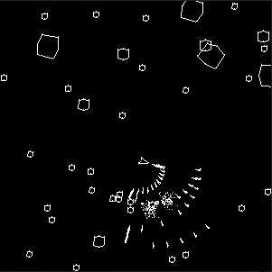

## ECS test

Small game to test entity component system (ECS).

ECS is a game architecture that is different and possibly more
performant than classic (typically) object oriented game design.

## Entt

For this project, i use a library (kind of out of character for me)
for handlig the ECS part of the application. For more information check

https://github.com/skypjack/entt
